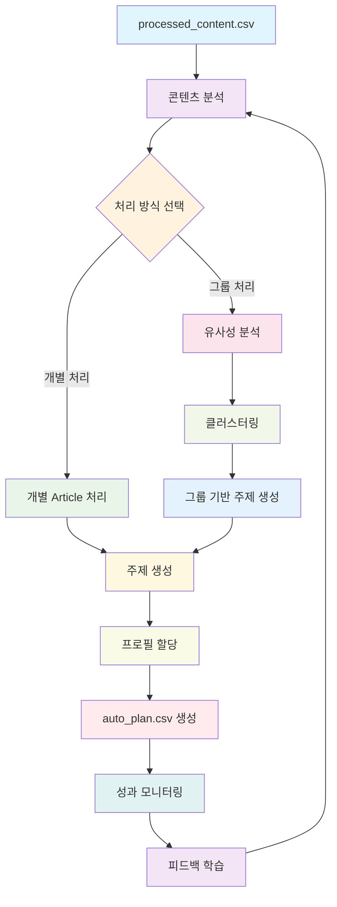

# Auto-planner 워크플로우

## 개요
`processed_content.csv`의 콘텐츠를 자동으로 분석하여 `auto_plan.csv`를 생성하는 지능형 계획 시스템입니다. 기본적으로 개별 article 처리를 지원하며, 향후 관련 콘텐츠를 그룹화하여 synthesizing하는 고급 기능을 제공합니다.

## 워크플로우 다이어그램



## Phase 1: 기본 Auto-planner (개별 Article 처리)

### 1.1 개별 Article 기본 처리

#### 목적
`processed_content.csv`의 각 항목을 개별적으로 `auto_plan.csv`에 추가합니다.

#### 처리 로직
```javascript
// 기본 처리 로직
async function processIndividualArticles(processedContent) {
    const autoPlanEntries = [];
    
    for (const item of processedContent) {
        const autoPlanEntry = {
            processed_ids: item.processed_id,
            subject: generateSubject(item.title),
            provider: "auto",
            model: "",
            profile: selectProfile(item.source_type, item.title)
        };
        autoPlanEntries.push(autoPlanEntry);
    }
    
    return autoPlanEntries;
}
```

#### 구현 예시
```javascript
// scripts/pipeline/auto_planner.js
import { promises as fs } from 'fs';
import Papa from 'papaparse';

async function generateAutoPlan() {
    console.log("🤖 Starting Auto-planner...");
    
    // 1. processed_content.csv 읽기
    const processedContent = await loadProcessedContent();
    
    // 2. 개별 article 처리
    const autoPlanEntries = await processIndividualArticles(processedContent);
    
    // 3. auto_plan.csv 저장
    await saveAutoPlan(autoPlanEntries);
    
    console.log(`✅ Generated ${autoPlanEntries.length} auto plan entries`);
}
```

### 1.2 자동 Subject 생성

#### 기능
제목 기반으로 의미있는 주제를 자동 생성합니다.

#### 생성 전략
```javascript
function generateSubject(title) {
    // 1. 제목에서 핵심 키워드 추출
    const keywords = extractKeywords(title);
    
    // 2. AI를 활용한 주제 확장
    const expandedSubject = expandWithAI(keywords, title);
    
    // 3. 카테고리별 주제 템플릿 적용
    const categorizedSubject = applyTemplate(expandedSubject, getCategory(title));
    
    return categorizedSubject;
}

// 예시 생성 결과
const examples = {
    "Blood tests are now approved for Alzheimer's": 
        "Analysis of: Blood tests are now approved for Alzheimer's: how accurate are they?",
    "Self-Assembly Gets Automated in Reverse of 'Game of Life'": 
        "Analysis of: Self-Assembly Gets Automated in Reverse of 'Game of Life'",
    "AI 블로그 SaaS로 2개월만에 엔화를 쓸어가는 창업가": 
        "Analysis of: AI 블로그 SaaS로 2개월만에 엔화를 쓸어가는 창업가"
};
```

### 1.3 기본 프로필 할당

#### 기능
콘텐츠 유형에 따른 적절한 프로필을 자동 선택합니다.

#### 할당 로직
```javascript
function selectProfile(sourceType, title) {
    const profileMap = {
        'nature': 'scientific_analysis',
        'quantamagazine.org': 'tech_analysis',
        'eopla.net': 'business_analysis',
        'realty.chosun.com': 'real_estate_analysis',
        'hani.co.kr': 'news_analysis',
        'm.blog.naver.com': 'blog_analysis',
        'docdocdoc.co.kr': 'medical_analysis',
        'news.hada.io': 'tech_news_analysis',
        'youtu.be': 'video_content_analysis'
    };
    
    // 소스 타입 기반 기본 할당
    let profile = profileMap[sourceType] || 'general_analysis';
    
    // 제목 키워드 기반 세부 조정
    if (title.includes('AI') || title.includes('기술')) {
        profile = 'tech_analysis';
    } else if (title.includes('창업') || title.includes('비즈니스')) {
        profile = 'business_analysis';
    } else if (title.includes('의료') || title.includes('건강')) {
        profile = 'medical_analysis';
    }
    
    return profile;
}
```

## Phase 2: 고급 Auto-planner (Synthesizing 전략)

### 2.1 콘텐츠 유사성 분석

#### 목적
관련된 기사들을 자동으로 그룹화하여 더 풍부한 콘텐츠를 생성합니다.

#### 분석 방법
```python
import numpy as np
from sklearn.feature_extraction.text import TfidfVectorizer
from sklearn.metrics.pairwise import cosine_similarity
from sklearn.cluster import DBSCAN

def analyze_content_similarity(articles):
    # 1. 텍스트 벡터화
    vectorizer = TfidfVectorizer(
        max_features=1000,
        stop_words='english',
        ngram_range=(1, 2)
    )
    vectors = vectorizer.fit_transform(articles['content'])
    
    # 2. 코사인 유사도 계산
    similarity_matrix = cosine_similarity(vectors)
    
    # 3. DBSCAN 클러스터링
    clustering = DBSCAN(
        eps=0.3,
        min_samples=2,
        metric='cosine'
    )
    clusters = clustering.fit_predict(vectors)
    
    return clusters, similarity_matrix
```

### 2.2 자동 그룹핑 알고리즘

#### 클러스터링 전략
```python
def group_related_articles(articles):
    # 1. 텍스트 전처리
    processed_texts = preprocess_texts(articles['content'])
    
    # 2. TF-IDF 벡터화
    vectorizer = TfidfVectorizer(
        max_features=2000,
        stop_words='english',
        ngram_range=(1, 3)
    )
    vectors = vectorizer.fit_transform(processed_texts)
    
    # 3. 유사도 계산
    similarity_matrix = cosine_similarity(vectors)
    
    # 4. 클러스터링
    clustering = DBSCAN(eps=0.25, min_samples=2)
    clusters = clustering.fit_predict(vectors)
    
    # 5. 그룹별 주제 생성
    grouped_plans = []
    for cluster_id in set(clusters):
        if cluster_id == -1:  # 노이즈 제외
            continue
            
        cluster_articles = articles[clusters == cluster_id]
        subject = generate_synthesis_subject(cluster_articles)
        
        grouped_plans.append({
            'processed_ids': ','.join(cluster_articles['processed_id']),
            'subject': subject,
            'provider': 'auto',
            'model': '',
            'profile': 'synthesis'
        })
    
    return grouped_plans
```

### 2.3 Synthesizing 전략

#### 전략 1: 비교 분석
```javascript
function generateComparisonSubject(articles) {
    const topics = articles.map(a => extractMainTopic(a.title));
    const uniqueTopics = [...new Set(topics)];
    
    if (uniqueTopics.length >= 2) {
        return `비교 분석: ${uniqueTopics[0]} vs ${uniqueTopics[1]} - 어떤 것이 더 나은가?`;
    }
    return `종합 분석: ${uniqueTopics[0]}에 대한 다각도 검토`;
}
```

#### 전략 2: 트렌드 분석
```javascript
function generateTrendSubject(articles) {
    const timeRange = getTimeRange(articles);
    const mainTopic = extractMainTopic(articles[0].title);
    
    return `2025년 트렌드 분석: ${mainTopic}의 변화와 전망 (${timeRange})`;
}
```

#### 전략 3: 심화 분석
```javascript
function generateDeepAnalysisSubject(articles) {
    const mainTopic = extractMainTopic(articles[0].title);
    const perspectives = articles.length;
    
    return `심화 분석: ${mainTopic}에 대한 ${perspectives}가지 관점에서의 종합 검토`;
}
```

## Phase 3: 지능형 Auto-planner

### 3.1 학습 기반 개선

#### 피드백 학습 시스템
```python
class FeedbackLearner:
    def __init__(self):
        self.performance_data = []
        self.user_preferences = {}
        
    def record_performance(self, plan_id, metrics):
        """성과 데이터 기록"""
        self.performance_data.append({
            'plan_id': plan_id,
            'timestamp': datetime.now(),
            'metrics': metrics
        })
        
    def update_preferences(self, user_id, preferences):
        """사용자 선호도 업데이트"""
        self.user_preferences[user_id] = preferences
        
    def optimize_planning(self):
        """계획 생성 최적화"""
        # 성과 데이터 분석
        high_performing_patterns = self.analyze_success_patterns()
        
        # 사용자 선호도 반영
        personalized_strategies = self.apply_user_preferences()
        
        return self.generate_optimized_plans(
            high_performing_patterns,
            personalized_strategies
        )
```

### 3.2 동적 주제 생성

#### 실시간 트렌드 반영
```python
class TrendAnalyzer:
    def __init__(self):
        self.social_media_api = SocialMediaAPI()
        self.search_trends_api = SearchTrendsAPI()
        
    def get_current_trends(self):
        """현재 트렌드 수집"""
        trends = {
            'social_media': self.social_media_api.get_trending_topics(),
            'search_queries': self.search_trends_api.get_trending_queries(),
            'news_keywords': self.get_news_keywords()
        }
        return trends
        
    def generate_trendy_subject(self, base_content, trends):
        """트렌드를 반영한 주제 생성"""
        relevant_trends = self.find_relevant_trends(base_content, trends)
        
        if relevant_trends:
            return f"트렌드 분석: {base_content}과 {relevant_trends[0]}의 연관성"
        else:
            return f"시의성 있는 분석: {base_content}의 최신 동향"
```

## 구현 로드맵

### 단계 1: 기본 Auto-planner 구현 (1-2주)

#### 파일 구조
```
scripts/pipeline/
├── auto_planner.js          # 메인 Auto-planner
├── subject_generator.js     # 주제 생성기
├── profile_selector.js      # 프로필 선택기
└── utils/
    ├── text_analyzer.js     # 텍스트 분석 유틸
    └── keyword_extractor.js # 키워드 추출기
```

#### 핵심 기능
```javascript
// scripts/pipeline/auto_planner.js
export async function generateAutoPlan(options = {}) {
    const {
        mode = 'individual',  // 'individual' | 'group' | 'hybrid'
        minSimilarity = 0.7,
        maxGroupSize = 5
    } = options;
    
    console.log(`🤖 Generating auto plan in ${mode} mode...`);
    
    // 1. 데이터 로드
    const processedContent = await loadProcessedContent();
    
    // 2. 모드별 처리
    let autoPlanEntries;
    switch (mode) {
        case 'individual':
            autoPlanEntries = await processIndividual(processedContent);
            break;
        case 'group':
            autoPlanEntries = await processGrouped(processedContent, minSimilarity);
            break;
        case 'hybrid':
            autoPlanEntries = await processHybrid(processedContent, minSimilarity, maxGroupSize);
            break;
    }
    
    // 3. 결과 저장
    await saveAutoPlan(autoPlanEntries);
    
    console.log(`✅ Generated ${autoPlanEntries.length} auto plan entries`);
    return autoPlanEntries;
}
```

### 단계 2: Synthesizing 전략 추가 (2-3주)

#### 고급 기능 구현
```python
# scripts/pipeline/advanced_planner.py
class AdvancedPlanner:
    def __init__(self):
        self.vectorizer = TfidfVectorizer()
        self.clustering_model = DBSCAN()
        self.subject_generator = SubjectGenerator()
        
    def analyze_content_similarity(self, articles):
        """콘텐츠 유사성 분석"""
        vectors = self.vectorizer.fit_transform(articles['content'])
        similarity_matrix = cosine_similarity(vectors)
        return similarity_matrix
        
    def cluster_articles(self, articles, similarity_threshold=0.7):
        """기사 클러스터링"""
        vectors = self.vectorizer.fit_transform(articles['content'])
        clusters = self.clustering_model.fit_predict(vectors)
        return self.group_by_clusters(articles, clusters)
        
    def generate_synthesis_subjects(self, clusters):
        """합성 주제 생성"""
        subjects = []
        for cluster in clusters:
            subject = self.subject_generator.generate_synthesis_subject(cluster)
            subjects.append(subject)
        return subjects
```

### 단계 3: 지능형 기능 추가 (3-4주)

#### 학습 시스템 구현
```python
# scripts/pipeline/intelligent_planner.py
class IntelligentPlanner:
    def __init__(self):
        self.feedback_learner = FeedbackLearner()
        self.trend_analyzer = TrendAnalyzer()
        self.performance_tracker = PerformanceTracker()
        
    def learn_from_feedback(self, plan_id, user_feedback, performance_metrics):
        """피드백 학습"""
        self.feedback_learner.record_feedback(plan_id, user_feedback)
        self.feedback_learner.record_performance(plan_id, performance_metrics)
        
    def adapt_to_trends(self, base_plans):
        """트렌드 적응"""
        current_trends = self.trend_analyzer.get_current_trends()
        adapted_plans = []
        
        for plan in base_plans:
            if self.should_adapt_to_trend(plan, current_trends):
                adapted_plan = self.adapt_plan_to_trend(plan, current_trends)
                adapted_plans.append(adapted_plan)
            else:
                adapted_plans.append(plan)
                
        return adapted_plans
```

## 기술 스택

### 텍스트 분석
- **spaCy**: 고급 자연어 처리
- **NLTK**: 기본 텍스트 처리
- **scikit-learn**: 머신러닝 및 클러스터링

### 클러스터링 및 분류
- **DBSCAN**: 밀도 기반 클러스터링
- **K-means**: 중심 기반 클러스터링
- **Hierarchical Clustering**: 계층적 클러스터링

### 주제 모델링
- **LDA**: 잠재 디리클레 할당
- **BERT**: 문맥 기반 임베딩
- **Word2Vec**: 단어 벡터화

### 성과 추적
- **Google Analytics**: 웹 분석
- **Custom Metrics**: 커스텀 성과 지표
- **A/B Testing**: 실험 설계

## 예상 결과

### Phase 1 완료 시
- **수작업 90% 감소**: 개별 기사 자동 처리
- **일관성 향상**: 표준화된 주제 생성
- **처리 속도 10배 향상**: 자동화된 워크플로우

### Phase 2 완료 시
- **콘텐츠 품질 향상**: 관련 기사 그룹핑으로 깊이 있는 분석
- **다양성 증가**: 다양한 synthesizing 전략
- **사용자 만족도 향상**: 더 풍부한 콘텐츠 제공

### Phase 3 완료 시
- **지속적 개선**: 피드백 기반 자동 최적화
- **트렌드 적응**: 실시간 트렌드 반영
- **개인화**: 사용자별 맞춤 계획 생성

## 모니터링 및 평가

### 성과 지표
```javascript
const performanceMetrics = {
    // 정량적 지표
    processingSpeed: 'articles_per_minute',
    accuracy: 'subject_relevance_score',
    userSatisfaction: 'user_rating_average',
    
    // 정성적 지표
    contentQuality: 'editor_review_score',
    diversity: 'subject_variety_index',
    innovation: 'new_topic_discovery_rate'
};
```

### A/B 테스트 설계
```javascript
const abTestConfig = {
    testGroups: ['individual_only', 'group_enhanced', 'hybrid_adaptive'],
    metrics: ['engagement_rate', 'completion_rate', 'user_satisfaction'],
    duration: '4_weeks',
    sampleSize: 1000
};
```

### 지속적 개선
- **주간 리뷰**: 성과 데이터 분석 및 패턴 파악
- **월간 최적화**: 알고리즘 업데이트 및 파라미터 조정
- **분기별 전략 수정**: 사용자 피드백 반영 및 전략 개선

---

*이 Auto-planner 워크플로우는 지속적인 학습과 개선을 통해 최적의 콘텐츠 계획을 자동으로 생성하는 것을 목표로 합니다.*
